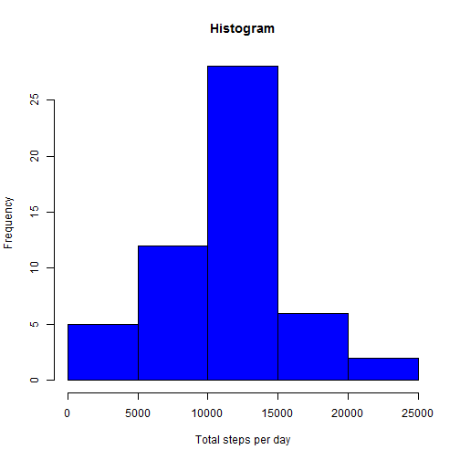
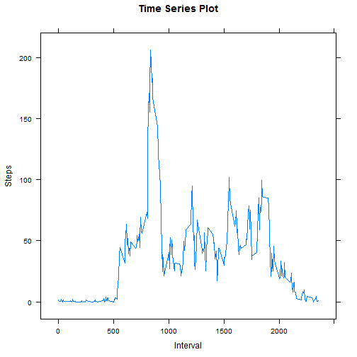
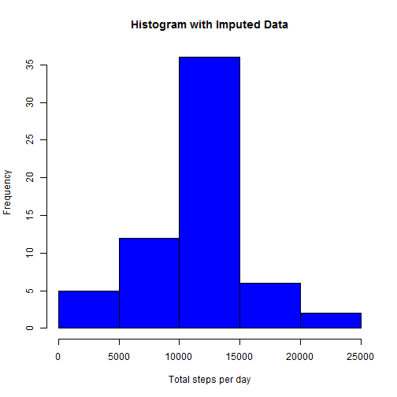

```r
# load the lattice library
library(lattice)
```

## Loading and preprocessing the data
1. Load the data (i.e. read.csv())

2. Process/transform the data (if necessary) into a format suitable for your analysis


```r
# 1. Load the data
dataset <- read.csv("activity.csv")

# 2. Convert date string to actual dates to use later
dataset$date <- as.Date(dataset$date, "%Y-%m-%d")
```


## What is mean total number of steps taken per day?
For this part of the assignment, you can ignore the missing values in the dataset.

1. Calculate the total number of steps taken per day

2. If you do not understand the difference between a histogram and a barplot, research the difference between them. Make a histogram of the total number of steps taken each day

3. Calculate and report the mean and median of the total number of steps taken per day


```r
# 1. Total steps
totalStepsPerDay <- aggregate(steps ~ date, dataset, FUN = sum, na.rm = TRUE)

# 2. Plot the histogram
hist(totalStepsPerDay$steps, col = "blue", main = "Histogram", xlab = "Total steps per day")
```

 

```r
# 3. Calculate and report mean/median
mean(totalStepsPerDay$steps)
```

```
## [1] 10766.19
```

```r
median(totalStepsPerDay$steps)
```

```
## [1] 10765
```


## What is the average daily activity pattern?
1. Make a time series plot (i.e. type = "l") of the 5-minute interval (x-axis) and the average number of steps taken, averaged across all days (y-axis)

2. Which 5-minute interval, on average across all the days in the dataset, contains the maximum number of steps?


```r
# 1. Time series plot
meanStepsPerInterval <- aggregate(steps ~ interval, dataset, FUN = mean, na.rm = TRUE)

#with(meanStepsPerInterval, plot(interval, steps, type = "l", main = "Time Series Plot"))
xyplot(steps ~ interval, meanStepsPerInterval, type = "l", main="Time Series Plot", xlab = "Interval", ylab = "Steps")
```

 

```r
# 2. Find interval containing max number of steps
meanStepsPerInterval[which.max(meanStepsPerInterval$steps),1]
```

```
## [1] 835
```


## Imputing missing values
Note that there are a number of days/intervals where there are missing values (coded as NA). The presence of missing days may introduce bias into some calculations or summaries of the data.

1. Calculate and report the total number of missing values in the dataset (i.e. the total number of rows with NAs)

2. Devise a strategy for filling in all of the missing values in the dataset. The strategy does not need to be sophisticated. For example, you could use the mean/median for that day, or the mean for that 5-minute interval, etc.

3. Create a new dataset that is equal to the original dataset but with the missing data filled in.

4. Make a histogram of the total number of steps taken each day and Calculate and report the mean and median total number of steps taken per day. Do these values differ from the estimates from the first part of the assignment? What is the impact of imputing missing data on the estimates of the total daily number of steps?


```r
# 1. Calculate and report number of missing values
sum(is.na(dataset))
```

```
## [1] 2304
```

```r
# 2. going to use the mean for the interval to fill in missing values

# 3. Creating new data set
imputedDataset <- dataset
for (i in 1:nrow(imputedDataset)) {
    if (is.na(imputedDataset$steps[i])) {
        imputedDataset$steps[i] <- meanStepsPerInterval[ meanStepsPerInterval$interval == imputedDataset$interval[i], 2]
    }
}

# 4. Repeating histogram and mean/median with imputed data
totalStepsPerDayImputed <- aggregate(steps ~ date, imputedDataset, FUN = sum, na.rm = TRUE)

hist(totalStepsPerDayImputed$steps, col = "blue", main = "Histogram with Imputed Data", xlab = "Total steps per day")
```

 

```r
mean(totalStepsPerDayImputed$steps)
```

```
## [1] 10766.19
```

```r
median(totalStepsPerDayImputed$steps)
```

```
## [1] 10766.19
```
The overall affect the imputed values have on the original data is pretty small. The mean is the same while the median is now the same as the mean. The histogram shows a slight increase in the number of days that now fall into the 10,000 - 15,000 range.


## Are there differences in activity patterns between weekdays and weekends?
For this part the weekdays() function may be of some help here. Use the dataset with the filled-in missing values for this part.

1. Create a new factor variable in the dataset with two levels - "weekday" and "weekend" indicating whether a given date is a weekday or weekend day.

2. Make a panel plot containing a time series plot (i.e. type = "l") of the 5-minute interval (x-axis) and the average number of steps taken, averaged across all weekday days or weekend days (y-axis). See the README file in the GitHub repository to see an example of what this plot should look like using simulated data.


```r
imputedDataset$day <- weekdays(imputedDataset$date)
imputedDataset$dayfactor <- c("weekday")

# 1. Create a new factor variable
for (i in 1:nrow(imputedDataset)) {
    
    if (imputedDataset$day[i] == "Saturday" || imputedDataset$day[i] == "Sunday") {
        imputedDataset$dayfactor[i] <- "weekend"
    }
}

# convert it to a factor
imputedDataset$dayfactor <- as.factor(imputedDataset$dayfactor)

meanStepsPerIntervalByDay <- aggregate(steps ~ interval + dayfactor, imputedDataset, mean)
xyplot(steps ~ interval | dayfactor, meanStepsPerIntervalByDay, type = "l", layout = c(1,2), xlab = "Interval", ylab = "Steps")
```

 
